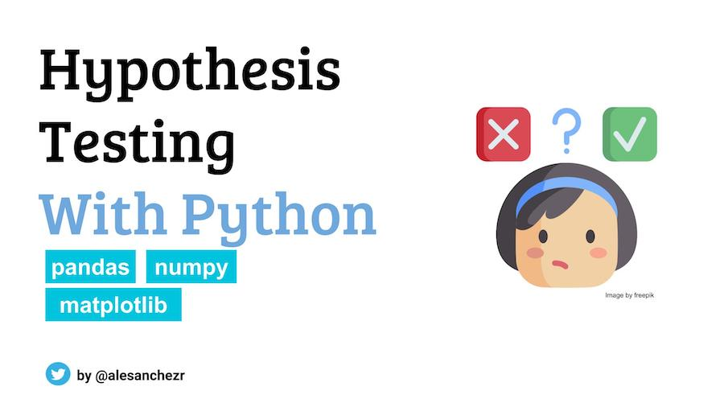

# Hypothesis Testing Exercises - Python Project



This repository contains reference solutions for hypothesis testing exercises designed for data science bootcamp students. The project includes practical statistical analysis problems using Python, focusing on hypothesis testing concepts and implementation.

## Project Overview

This educational project provides hands-on experience with:
- **Hypothesis Testing**: Null and alternative hypothesis formulation
- **Statistical Tests**: Student's t-tests and other statistical methods
- **Data Analysis**: Weight loss diet comparison and other real-world scenarios
- **Python Libraries**: scipy, matplotlib for statistical computing and visualization

## Using this Repository

### Method 1: GitHub Codespaces (Recommended)

**Prerequisites:**
- A GitHub account
- Basic knowledge of Python and statistics

**Step 1: Fork the Repository**
1. Navigate to this repository on GitHub
2. Click the **"Fork"** button in the top-right corner
3. Select your GitHub account as the destination for the fork

**Step 2: Launch GitHub Codespace**
1. In your forked repository, click the green **"Code"** button
2. Select the **"Codespaces"** tab
3. Click **"Create codespace on main"**
4. Wait for the environment to set up (this may take a few minutes)

**Step 3: Open the Notebook**
1. Once the Codespace is ready, navigate to the file explorer
2. Open `problems.ipynb` to start working with the exercises
3. The environment will automatically install all required dependencies

### Method 2: Running Locally

If you prefer to run the project locally instead of using Codespaces:

**Prerequisites:**
- Python 3.11 or higher
- pip package manager
- virtualenv module (install with `pip install virtualenv` if not available)
- VS Code or Jupyter Notebook installed

**Installation Steps:**
1. Clone your forked repository:
   ```bash
   git clone https://github.com/YOUR_USERNAME/gperdrizet-hypothesis-testing-exercises-project-with-python.git
   cd gperdrizet-hypothesis-testing-exercises-project-with-python
   ```

2. Create and activate a virtual environment:
   ```bash
   # Create virtual environment
   python -m venv hypothesis-testing-env
   
   # Activate virtual environment
   # On Linux/macOS:
   source hypothesis-testing-env/bin/activate

   # On Windows:
   # hypothesis-testing-env\Scripts\activate
   ```

3. Install dependencies:
   ```bash
   pip install -r requirements.txt
   ```

4. Open the notebook in Jupyter or VS Code:

   - If using Jupyter Notebook, run:
     ```bash
     jupyter notebook problems.ipynb
     ```
   - If using VS Code, open the folder in VS Code and use the Jupyter extension to open the notebook.

5. When finished, deactivate the virtual environment:
   ```bash
   deactivate
   ```

## Repository Structure

```
├── .devcontainer/
│   └── devcontainer.json      # Development container configuration
├── assets/
│   └── preview.jpeg           # Project preview image
├── problems.ipynb             # Main notebook with exercises and solutions
├── requirements.txt           # Python dependencies
└── README.md                  # This file
```

## Dependencies

The project uses the following Python packages (automatically installed in Codespaces):

- **ipykernel**: Jupyter kernel for Python
- **matplotlib**: Data visualization library
- **scipy**: Scientific computing library for statistical functions

## Exercise Content

The notebook includes:

### Exercise 1: Diet Comparison Study
- **Scenario**: Comparing weight loss between two different diet groups
- **Statistical Method**: Student's t-test
- **Learning Objectives**: 
  - Formulating null and alternative hypotheses
  - Performing statistical tests
  - Interpreting results and drawing conclusions

Additional exercises may cover various hypothesis testing scenarios relevant to data science applications.

## Learning Objectives

By completing these exercises, students will:
- Understand the fundamental concepts of hypothesis testing
- Learn to formulate appropriate null and alternative hypotheses
- Gain hands-on experience with statistical tests in Python
- Develop skills in interpreting statistical results
- Practice data analysis using real-world scenarios

**Happy Learning!** 📊🐍

*This repository serves as a reference solution for educational purposes. Students are encouraged to work through the problems independently before consulting the solutions.*
